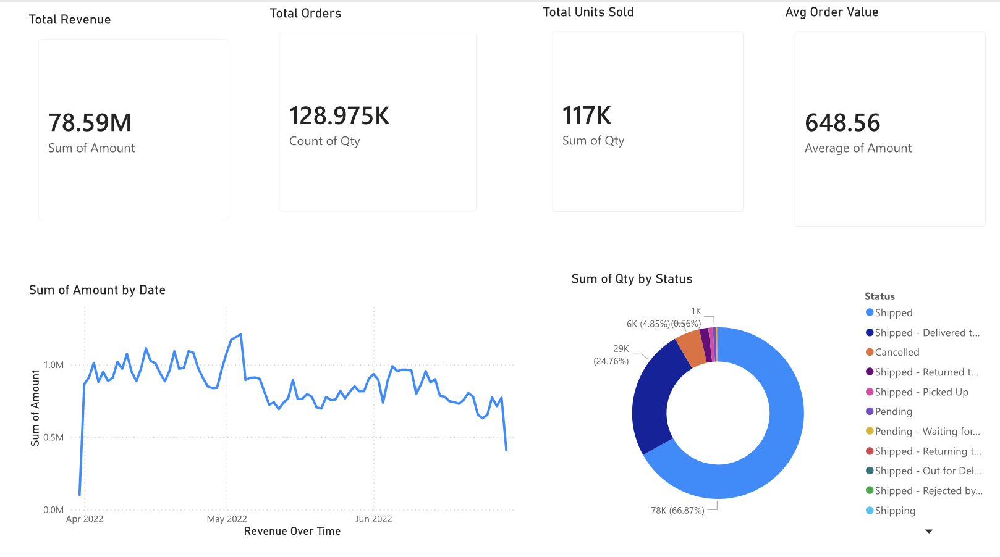
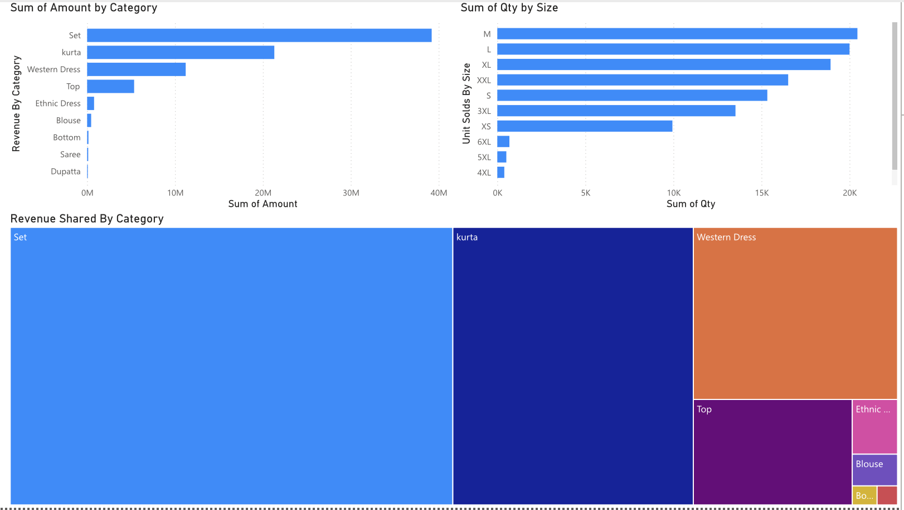
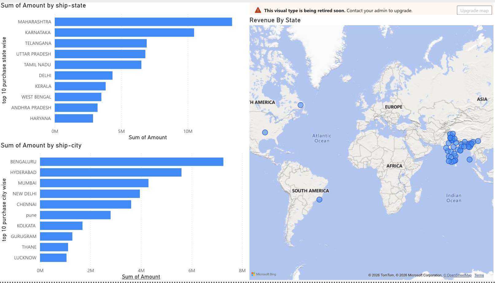
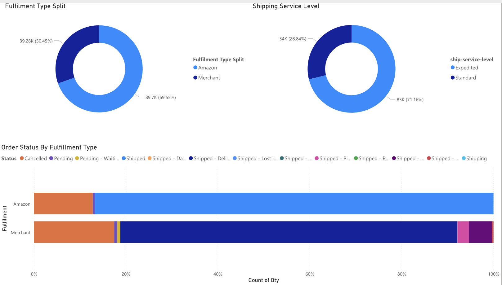
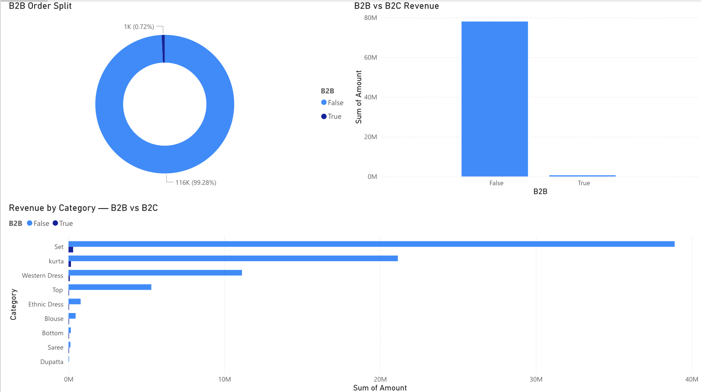

# 🛒 Amazon Sales Analysis — Power BI Dashboard

## 📌 Project Overview
An interactive Power BI dashboard analyzing Amazon India 
sales data to uncover revenue trends, product performance, 
geographic demand, and fulfillment efficiency.

## 🎯 Objectives
- Track revenue and order trends over time
- Identify top performing product categories and sizes
- Analyze fulfillment and shipping patterns
- Understand B2B vs B2C sales distribution

## 📊 Dashboard Pages
| Page | Description |
|------|-------------|
| Executive Summary | KPIs, revenue trend, order status |
| Product Performance | Category and size analysis |
| Geographic Analysis | State and city level order mapping |
| Fulfillment Analysis | Delivery method and service analysis |
| B2B vs B2C | Segment comparison |

## 🛠️ Tools Used
- Power BI Service (browser based)
- Power Query (data cleaning)
- DAX (calculated measures)

## 🗂️ Dataset
- Source: Kaggle — Amazon Sales Report
- Records: ~130,000 rows
- Key Fields: Order ID, Date, Category, 
  Amount, State, Status, Fulfilment

## 📸 Screenshots






## 🔗 Live Dashboard
[View Live Dashboard](PASTE YOUR POWER BI PUBLISH LINK HERE)

## 👤 Author
Jaineeljoshi18 | [GitHub](https://github.com/Jaineeljoshi18)
```

---

## 🟢 STEP 5 — Commit the README
- Scroll down
- Type **"Add README"** in commit box
- Click green **"Commit changes"**

---

## 🟢 STEP 6 — Check Your Repo
- Go back to main repo page
- Your repo should now look like this:
```
amazon-sales-powerbi-dashboard/
│
├── 📁 page1_executive_summary.png
page2_product_performance.png
page3_geographic_analysis.png
page4_fulfillment_analysis.png
page5_b2b_vs_b2c.png
├── 📁 Amazon_sales_dataset
└── README.md
